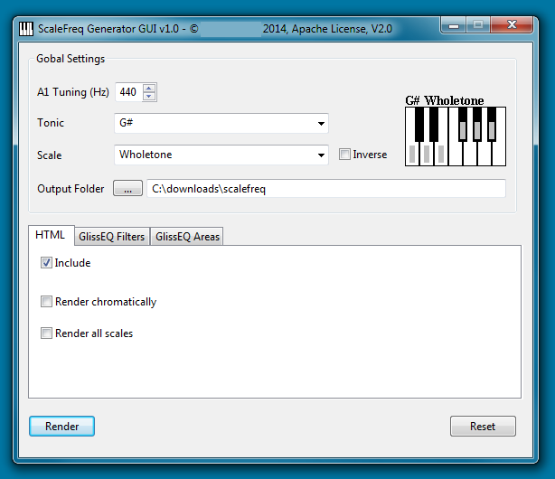
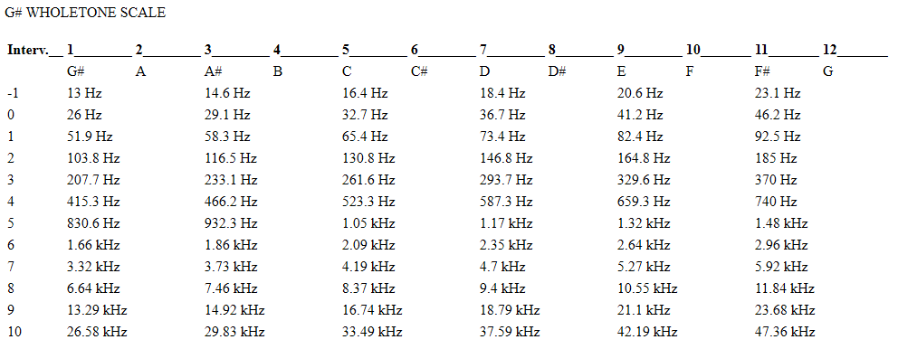
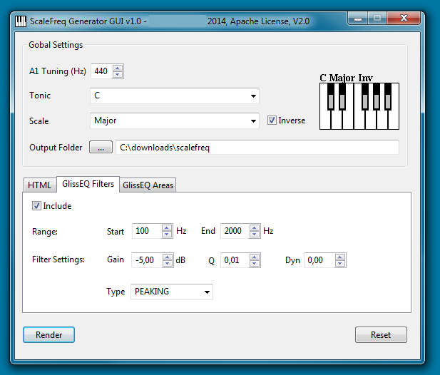
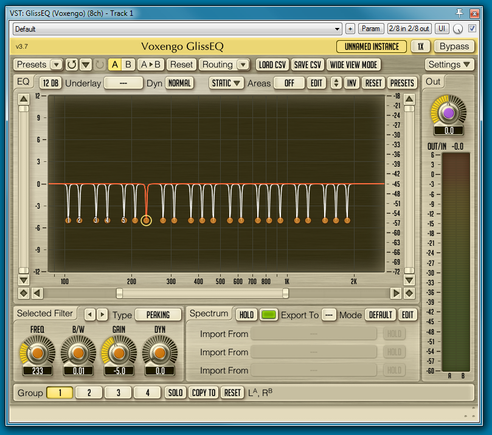
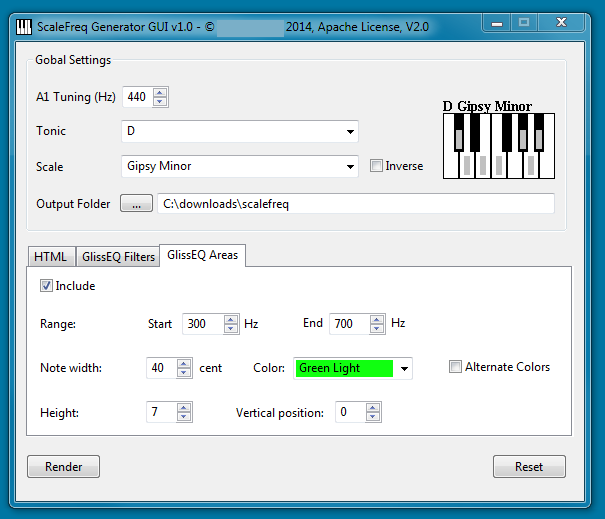
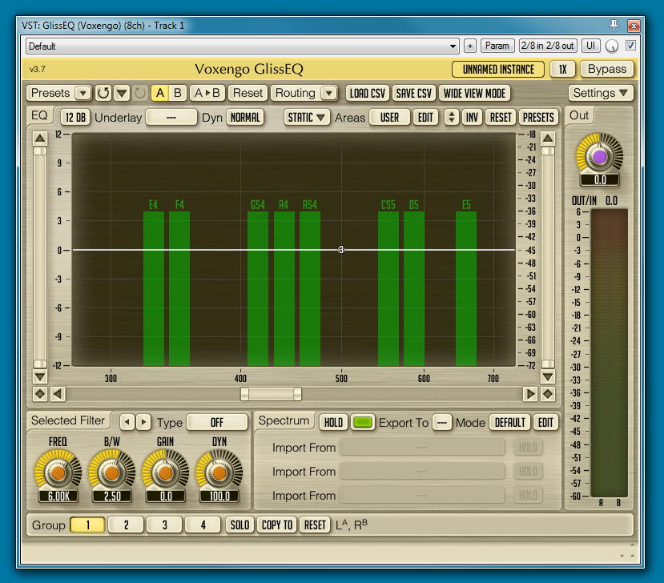
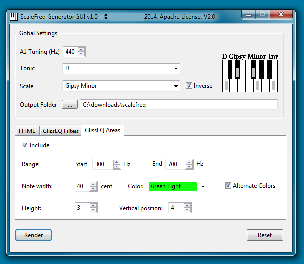
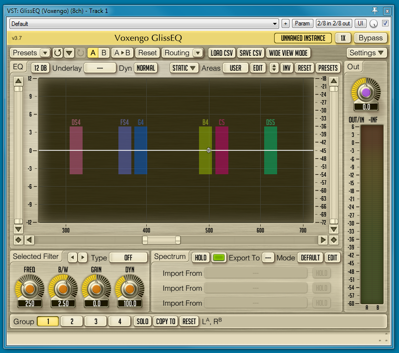

# ScaleFreq Generator
Scalefreq Generator is a tool for rendering frequencies of notes / musical scales into various output formats. It’s primarily aimed for mixing/mastering engineers and other musical interested people. The  frequencies of musical scale or non-scale notes (inverse) are important  in mixing and mastering situations. E.g. non-scale frequencies are often attenuated using an EQ. 

Scalefreq consists of a core system, a render-plugin architecture and a graphical frontend for convenient user interaction.

Currently the following output format renderer are included:

- HTML Renderer: generates HTML pages which contains scale frequency tables
- Voxengo GlissEQ Filter Renderer: generates importable EQ presets for Voxengo GlissEQ VST plugin
- Voxengo GlissEQ Areas Renderer: generates importable EQ Areas presets for Voxengo GlissEQ VST plugin

**INSTALLATION**

Download the latest release (e.g. 1.0.1) as scalefreq_x_xx.jar here from Github

A Java 1.7 Runtime Environment (JRE or JDK) or higher is required.
The following platforms are supported:

- Windows (32/64)
- Linux GTK (32/64)
- MacOS (32/64)

In order to start the program, just double click the file  “scalefreq_x_xx.jar”.  If this doesn't work, try to start from the  command line:
 `java -jar scalefreq_x_xx.jar`

E.g. on windows:
 `press windows key+r, "cmd" -> java -jar path to scalefreq_x_xx.jar`

HINT: scalefreq stores all made settings in the current user profile. In order to reset the settings press the reset button.

**HTML RENDERER**

The HTML Renderer creates frequency tables in HTML format for any  specific scale. Alternatively it can render all tonic variations of a  scale (chromatically). Also a huge HTML file can be generated, which  contains all available Scalefreq scales.  

Render output:

**GLISS EQ FILTER RENDERER**

The Gliss EQ filter renderer generates CSV files which can be  imported into Voxengo Gliss EQ VST plugin. Thus, it’s e.g. possible to  conveniently import notch/peaking filters for non-scale notes (= inverse  scale).

Imported render output:

**GLISS EQ AREAS RENDERER**

The Gliss EQ area renderer also generates CSV files which can be  imported into Voxengo Gliss EQ VST plugin in order to create colorful EQ  areas marker. 

Imported render output:

Inverse and alternate colors:

Imported render output:

**CHANGELOG**

- 1.0  – initial release (no longer available)
- 1.01 - proper multi platform support for Win,Mac,Linux (all 32/64),  better font for multi platform (Arial), default frequency range for  GlissEQFilter renderer is now 20 Hz..20 KHz
